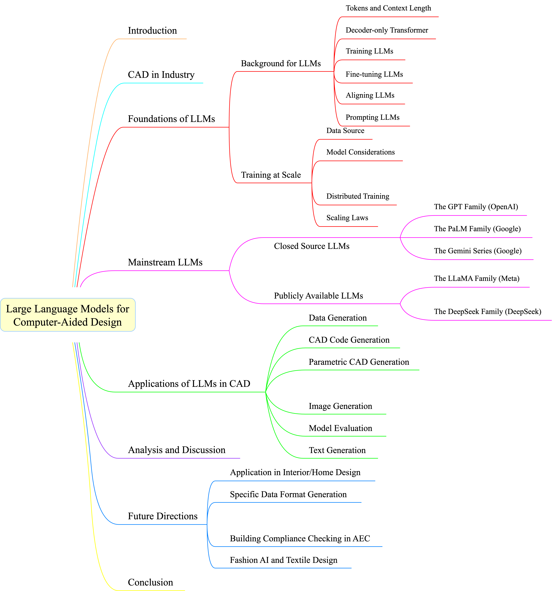

# Large Language Models for Computer-Aided Design: A Survey

This repo is constructed for collecting papers on state-of-the-art large language models as well as their applications on computer-aided design according to our survey paper——[_**Large Language Models for Computer-Aided Design: A Survey**_]().
# Overview

# Catalogue
## [LLMs Taxonomy](#1)
### [Closed Source LLMs](#1.1)
- [The GPT Family](#1.1.1)
- [The PaLM Family](#1.1.2)
- [The Gemini Series](#1.1.3)
### [Publicly Available LLMs](#1.2)
  - [The LLaMA Family](#1.2.1)
  - [The DeepSeek Family](#1.2.2)
### [Others](#1.3)
## [CAD Application Taxonomy](#2)
### [Data Generation](#2.1)
### [CAD Code Generation](#2.2)
### [Parametric CAD Generation](#2.3)
### [Image Generation](#2.4)
### [Model Evaluation](#2.5)
### [Text Generation](#2.6)

## LLMs Taxonomy

### 1. Closed Source LLMs

#### 1.1 The GPT Family

#### 1.2 The PaLM Family

#### 1.3 The Gemini Family

### 2. Closed Source LLMs

#### 2.1 The LLaMA Family

#### 2.2 The DeepSeek Family

### 3. Others

## CAD Application Taxonomy

### 1. Data Generation

### 2. CAD Code Generation

### 3. Parametric CAD Generation

### 4. Image Generation

### 5. Model Evaluation

### 6. Text Generation

